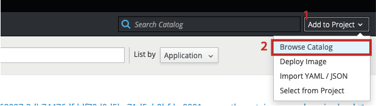

# *Pizza Order*

*Pizza Order* es un *asset* desarrollado con tecnología *.NET Core*, con él demostramos en el escenario 3 como puede usarse *Openshift* para simplificar el trabajo que requiere el despliegue de una aplicación. 

Con este ejercicio vemos como *Openshift* nos permite

  - Trabajar con tecnologías diversas
  - Acelerar el proceso
  - Desplegar sin un *dockerfile*
  - Hacer un despliegue desde un git privado y empresarial

## ¡Hazlo tu mismo!

  - Sigue esto sencillos pasos y despliega tu aplicación *.NET Core* 
  - ¿No tienes una aplicación? Usa este *asset*

### Prerrequisitos

Para poder llevar acabo ese ejercicio requerirás:

* Generar una [llave SSH](https://help.github.com/es/enterprise/2.16/user/github/authenticating-to-github/generating-a-new-ssh-key-and-adding-it-to-the-ssh-agent) - tener la parte pública y privada
* Tener acceso a un clúster [*Openshift*](https://www.*Openshift*.com/), nosotros usaremos la versión 3.11
* Un desarrollo con [*.NET* versión 2.1](https://dotnet.microsoft.com/download/dotnet-core/2.1)
* Acceso a un repositorio [GitHub](https://github.com/)
* En caso de haber decidido usar este *asset* [realizar una bifurcación](https://help.github.com/es/github/getting-started-with-github/fork-a-repo), también conocida como *fork*,  del repositorio. Más adelante veremos el porqué

### Instalación

¡No requieres ninguna!, eso es parte de la belleza de este escenario

En este repositorio encontraras el código del *asset* con *.NET* v2.1 en la rama
[Pizza-Order-dotNetv2-1](../../tree/Pizza-Order-dotNetv2-1)

La rama [master](../../tree/master) tiene el mismo *asset* en *.NET* v3.1

## Comencemos

Para poder realizar el despliegue de nuestra aplicación lo primero que haremos será ingresar a nuestro clúster y crear un nuevo proyecto. Lo podemos hacer de manera muy sencilla en la consola web de nuestro clúster. Solo tenemos que dar clic en *+ Create Project*. [Aquí](https://docs.*Openshift*.com/container-platform/3.11/dev_guide/projects.html) encontrarás más información de como hacerlo.

Una vez creado el proyecto pasaremos a elegir una tecnología en el catalogo de tecnologías (Browse Catalog)

Esto nos llevara a ver el catalogo de tecnologías, donde seleccionaremos *.NET Core*.
Nos mostrará una pantalla en la cual daremos siguiente y le pondremos un nombre a la aplicación en el campo *Application Name*. Recomendamos usar un nombre descriptivo.

El siguiente paso será poner la liga del repositorio, utilizaremos la liga ssh que genera GitHub, en el campo *Git Repository*.

----add image----

>el campo de versión lo dejaremos como está, 2.1
>en caso de que nuestro repositorio fuese público y el código que deseáramos desplegar se encontrase en la rama master, podríamos solo asegurarnos de apuntar a donde viviría nuestro *dockerfile* y habríamos terminado.

Daremos clic en *advanced options* lo que nos mostrará más opciones de configuración

En el campo *Git Reference* pondremos el nombre de la rama, en nuestro caso `Pizza-Order-dotNetv2-1` que es donde se encuentra la versión en *.NET Core* 2.1.
 En *Context Dir* ingresaremos la dirección en la que viviría nuestro *dockerfile* `/Pizza-Order-2.1`. Ahora, hagamos uso de la seguridad y agreguemos un secreto
 
 #### Agrega un secreto
 
 Debido a que nuestro repositorio es privado, y además se encuentra en un GitHub empresarial deberemos agregar un secreto, esto es para lograr la comunicación entre nuestro clúster y el repositorio a través de ssh. Para esto requeriremos la llave que generamos en los prerrequisitos 
 
 Una ves generada esa llave tendremos un archivo `id_rsa` y un `id_rsa.pub` si mantuvimos los valores predeterminados al crearlo. El `id_rsa` es la llave privada, esta deberá encontrarse en el clúster de *Openshift* y la llave publica `id_rsa.pub` deberá encontrarse en el repositorio.
 
 Debido a que tenemos que agregar esta llave pública a nuestro repositorio es la razón por la cual hicimos la bifurcación si decidiste usar este *asset*. Ahora te enseñaremos a agregar esa llave. En la parte superior derecha encontrarás el botón de configuración.
 
 Cuando estemos en configuración del lado izquierdo veremos una opción que dice *Deploy Key*. Crearemos una nueva llave de despliegue en *add deploy key*
 
 En este lugar copiaremos el contenido del archivo `id_rsa.pub` en el campo correspondiente, después de nombrar esta llave de despliegue. Recuerda que es mejor usar un nombre descriptivo para identificarlas fácilmente.
 
 Una vez guardada la llave pública continuaremos con el despliegue en *Openshift*. Crearemos un secreto nuevo, le daremos un nombre descriptivo y cambiaremos el tipo de autenticación a *ssh key*. Copiaremos nuestra llave ssh, la privada, aquí. *Openshift* también nos da la facilidad de subir el archivo `ìd_rsa`. Creamos el secreto
 
 #### Construcción
 
 Ahora sí, ¡agárrate que se viene lo bueno!
 
 En este momento podemos configurar más cosas si así lo deseáramos, pero para efectos prácticos podemos dejar los demás parámetros por defecto. Y esta es una de las grandes bondades de *Openshift*, podemos hacer un despliegue rápido y básico o meternos a parametrizar diversas cosas. Todo depende de que queramos lograr.
 
 El siguiente paso es ...  ¡CREAR!
 
 Y en este momento nuestra aplicación ya empieza a ser construida por *Openshift*.
 Lo que *Openshift* está haciendo es ir a consultar el repositorio, donde se encuentra nuestro código. Empezar a montar un *dockerfile* con el cual creara un contenedor y así subir este al clúster.  Y lo mejor, es que no tendremos que preocuparnos de esto.
 
 Una vez que termine de construir el contenedor y subir la imagen, levantara la aplicación en un *pod*, el cual escalar a gusto. Cuando este disponible este *pod* podremos ingresar a nuestra aplicación a través de la ruta que genera. esta ruta ya es pública y cualquiera de nuestros usuarios podrá ingresar.
 
 # ¡Felicidades!, has desplegado una aplicación en *Openshift*
 ### Usando tecnología *.NET* y sin necesidad de crear un *dockerfile*
